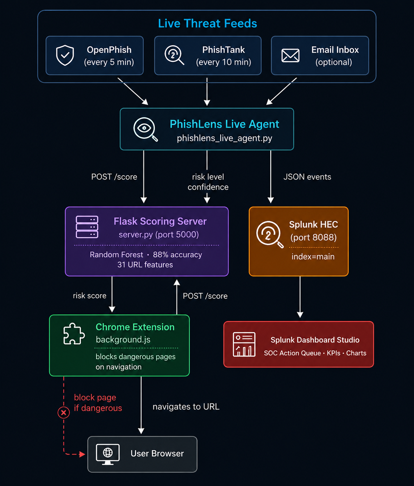

# 🎣 PhishLens — AI Threat Intelligence

> **Autonomous AI-powered financial phishing detection agent built on Splunk ML Toolkit**
> Splunk Agentic Ops Hackathon 2026 · Security Track

---

## 🎥 Demo Video

[Watch the demo on YouTube](https://youtu.be/nTH4JuiPLKo)

---

## 🎯 What is PhishLens?

PhishLens is an **agentic AI system** that continuously pulls real phishing
URLs from live threat-intelligence feeds, scores each one with a Splunk
ML Toolkit model, and surfaces the results to both a SOC dashboard and an
end-user browser phishlens-extension.

It combines:

- **Splunk ML Toolkit** — Random Forest model trained on 11,430 labeled URLs (88.29% accuracy)
- **Live threat feeds** — OpenPhish (every 5 min), PhishTank (every 10 min), optional email inbox scanning
- **Real-time Splunk dashboard** — SOC-grade visibility into every scored URL, risk level, and recommended action
- **Chrome browser phishlens-extension** — automatically scores the page you're visiting and blocks it if it's flagged as phishing

---

## 🏗️ Architecture



---

## ⬡ Agentic Pipeline

PhishLens runs as a continuous agent — no manual triggering required:

| Step | Action | Details |
|---|---|---|
| ➊ FETCH | Ingest live URLs | OpenPhish (5 min) · PhishTank (10 min) · Email inbox (optional, 8 hrs) |
| ➋ EXTRACT | Feature engineering | 31 features: domain age, subdomain depth, brand-impersonation signals, character repeats, digit ratios, phishing-hint keywords |
| ➌ SCORE | ML classification | Random Forest model outputs a phishing probability (0–100%) |
| ➍ DECIDE | Risk assessment | CRITICAL (brand impersonation + abnormal subdomain) · HIGH (one of those signals) · MEDIUM (phishing-hint keywords) · SAFE |
| ➎ ACT | Surface the result | CRITICAL/HIGH/MEDIUM → flagged for SOC review and blocked by the browser phishlens-extension on navigation · SAFE → allowed |
| ➏ INDEX | Audit trail | Every scored URL written to Splunk via HEC, viewable live on the dashboard |

---

## 🛡️ Browser Protection

- The **Chrome phishlens-extension** scores every page as you navigate to it
- If the score is CRITICAL, HIGH, or MEDIUM risk **and** classified as phishing, the page is replaced with a warning screen showing the risk level and model confidence, with a one-click "back to safety" option
- A content script also shows a small on-page badge when hovering over links, using the same scoring API
- If the local scoring server isn't running, the phishlens-extension **fails open** — browsing isn't blocked, it just isn't scored

---

## 🚀 Setup & Run

### Prerequisites

- Python 3.10+
- Splunk Enterprise (free trial or developer license)
- Google Chrome (or any Chromium-based browser) for the phishlens-extension

### Installation

```bash
# 1. Clone the repo
git clone https://github.com/2205-lab/PhishLens.git
cd PhishLens

# 2. Install dependencies
pip install flask requests schedule python-dotenv scikit-learn pandas

# 3. Configure environment
cp .env.example .env
# Edit .env with your own Splunk HEC token (and email creds if you want
# inbox monitoring — both are optional for the email features)

# 4. Enable Splunk HEC
# Splunk → Settings → Data Inputs → HTTP Event Collector
# → Global Settings → Enable → New Token → index=main

# 5. Start the Flask scoring server
python server.py

# 6. Start the live agent (new terminal)
python phishlens_live_agent.py

# 7. Load the dashboard
# Splunk → Dashboards → New → Dashboard Studio → Source → paste phishlens_dashboard.json

# 8. Install the browser phishlens-extension
# Chrome → chrome://phishlens-extensions/ → enable Developer mode
# → Load unpacked → select the "phishlens-extension" folder
```

### Environment Variables (.env)

See `.env.example` for the full list. At minimum you need:

```
SPLUNK_HEC_URL=http://localhost:8088/services/collector
SPLUNK_HEC_TOKEN=your-hec-token-here
PHISHLENS_API=http://localhost:5000/score
```

Email monitoring (`EMAIL_USER`, `EMAIL_PASS`, etc.) is optional — if left
blank, that feeder simply doesn't run.

---

## 📁 Project Structure

```
PhishLens/
├── server.py                    # Flask scoring API + ML model
├── phishlens_live_agent.py      # Agent: fetches feeds, scores, sends to Splunk
├── phishlens_dashboard.json     # Splunk Dashboard Studio definition
├── phishlens-extension/                    # Chrome browser phishlens-extension
│   ├── manifest.json
│   ├── background.js            # Navigation interceptor + scoring
│   ├── content.js                # Hover-badge link scanner
│   ├── blocked.html              # Warning page for flagged sites
│   ├── popup.html / popup.js     # phishlens-extension popup UI
├── architecture_diagram.png              # System diagram
├── evaluate_model.py             # Model evaluation & tuning script
├── .env.example                  # Environment template
└── README.md
```

---

## 🧠 ML Model

- **Algorithm:** Random Forest Classifier (Splunk ML Toolkit)
- **Training data:** 11,430 labeled URLs (phishing + legitimate)
- **Accuracy:** 88.29%
- **Features (31 total):**
  - URL structure: length, dots, hyphens, slashes, digits
  - Brand signals: brand_in_path, brand_in_subdomain, domain_in_brand
  - Domain signals: abnormal_subdomain, domain_age, dns_record
  - Content signals: phish_hints, char_repeat, avg_word_host
  - Ratio features: ratio_digits_url, ratio_digits_host

`evaluate_model.py` includes a recall-optimized hyperparameter search and
reports precision/recall/false-negative rate alongside accuracy — for a
phishing classifier, missing a real threat (false negative) is costlier
than an occasional false alarm.

---

## 💰 Business Impact

PhishLens addresses a **$3.5 billion annual problem** (FBI IC3 2023):

- Every flagged CRITICAL/HIGH URL is a credential-theft attempt surfaced before the user enters data
- SOC analysts get a prioritized action queue instead of raw alert noise
- Runs entirely on tools security teams already operate (Splunk + a lightweight Python agent)

---

## 🏆 Hackathon Track

**Security** — Splunk Agentic Ops Hackathon 2026

Judging criteria alignment:

- ✅ **Technological Implementation** — agentic pipeline, ML scoring, HEC integration, browser phishlens-extension
- ✅ **Design** — SOC dashboard with live KPIs, prioritized action queue, and severity breakdown
- ✅ **Potential Impact** — financial phishing costs billions; this surfaces and blocks threats in real time
- ✅ **Quality of Idea** — combines Splunk ML scoring with browser-level enforcement and a continuous live-feed pipeline

---

## 📄 License

MIT License — see [LICENSE](LICENSE) for details.

---

*Built for the Splunk Agentic Ops Hackathon 2026*
